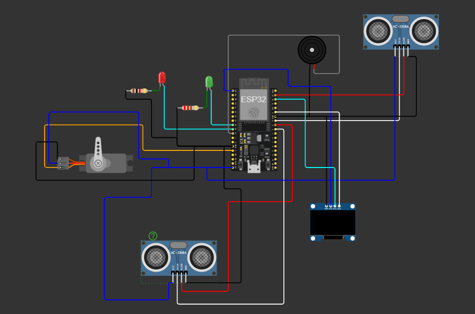
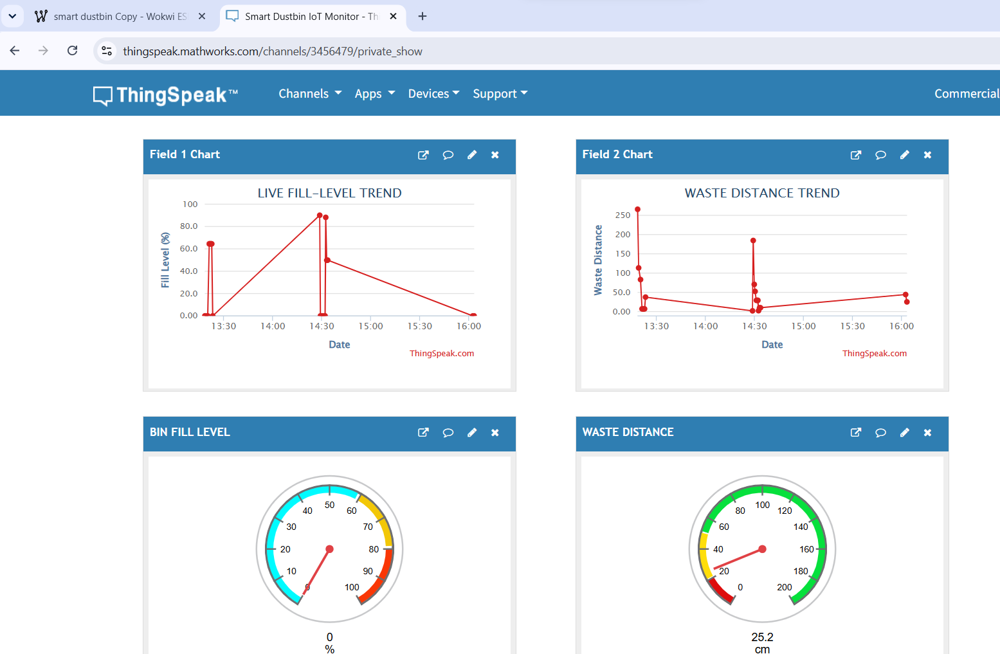
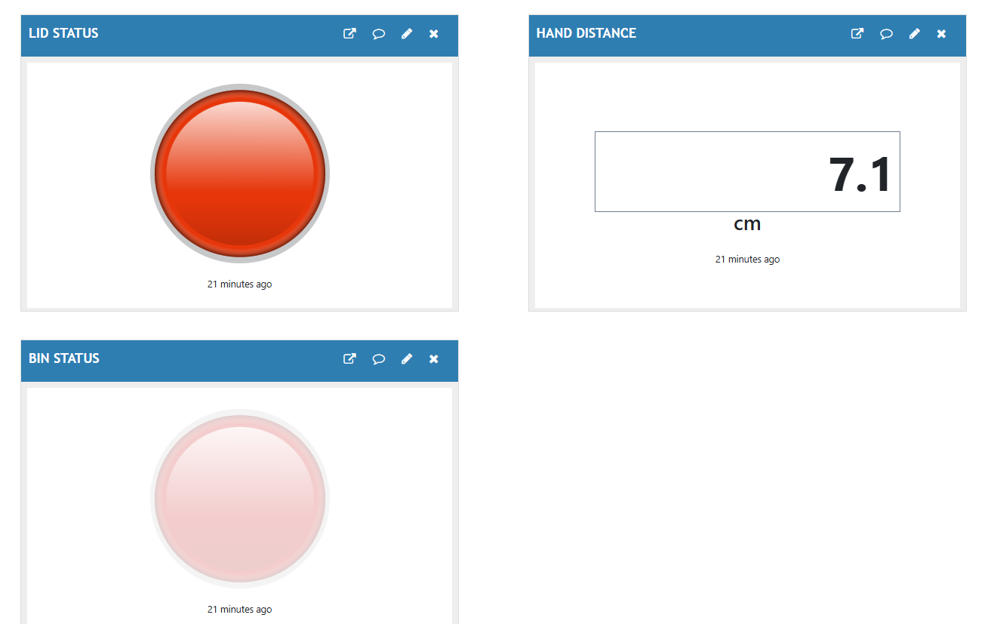

# 🗑️ SmartWaste Management System

<p align="center">
  
</p>

<h3 align="center">
  ESP32 • Embedded Systems • IoT • Automation • Sensor Integration
</h3>

<p align="center">
  <strong>An intelligent ESP32-based waste management system with automatic lid control, real-time waste-level monitoring, local alerts, and cloud connectivity.</strong>
</p>

<p align="center">
  
  
  
  
  
</p>

<p align="center">
  <a href="#-overview">Overview</a> •
  <a href="#-system-architecture">Architecture</a> •
  <a href="#-hardware">Hardware</a> •
  <a href="#-testing--validation">Testing</a> •
  <a href="#-roadmap">Roadmap</a>
</p>

---

## 📖 Overview

**Smart Dustbin Embedded System** is an engineering-focused ESP32 project that demonstrates how embedded hardware, firmware, sensing, automation, and IoT communication can be integrated into one practical system.

Two ultrasonic sensors provide separate functions: one detects a nearby hand for contactless lid operation, while the other estimates the amount of waste inside the bin. The ESP32 processes these measurements and controls a servo motor, OLED display, LEDs, and buzzer according to the system state.

The project also extends the embedded system into the IoT layer by sending monitoring data to ThingSpeak over Wi-Fi. The repository contains the firmware, circuit diagram, architecture documentation, simulation files, testing evidence, screenshots, and project report.

This makes the project suitable as an **ECE / Embedded Systems / IoT portfolio project** demonstrating both hardware-software integration and engineering documentation.

---

## ✨ Key Features

- ✋ **Contactless operation** — detects a nearby hand without physical interaction.
- ⚙️ **Automatic lid control** — servo motor opens and closes the lid based on hand detection.
- 📏 **Waste-level monitoring** — ultrasonic sensing estimates the distance to the waste surface.
- 📊 **Fill-level calculation** — converts sensor distance into an estimated percentage.
- 🚨 **Intelligent alerts** — LED and buzzer states change according to bin capacity.
- 📺 **Local monitoring** — OLED provides immediate system information without requiring the cloud.
- 📡 **IoT connectivity** — ESP32 communicates over Wi-Fi.
- ☁️ **Cloud monitoring** — ThingSpeak is used for remote data visualization.
- 🧪 **Simulation support** — Wokwi resources allow firmware behavior to be tested before hardware deployment.
- 📸 **Visual verification** — repository includes screenshots for normal, full-bin, hand-detection, and hand-removal states.
- 📚 **Engineering documentation** — architecture, pin configuration, simulation notes, and a formal project report are included.

---

## 🎯 Project Objective

The system is designed around a simple engineering goal:

> **Detect → Measure → Decide → Act → Display → Communicate**

The project demonstrates how a microcontroller can combine multiple sensors, process their readings, make real-time decisions, control physical hardware, and publish useful information to an IoT platform.

---

# 🧠 System Architecture

<p align="center">
  
</p>

### High-Level Architecture

```text
                         SMART DUSTBIN
                              │
             ┌────────────────┴────────────────┐
             │                                 │
             ▼                                 ▼
      ┌──────────────┐                 ┌──────────────┐
      │ HC-SR04 #1   │                 │ HC-SR04 #2   │
      │ Hand Sensor  │                 │ Waste Sensor │
      └──────┬───────┘                 └──────┬───────┘
             │                                 │
             └────────────────┬────────────────┘
                              ▼
                       ┌─────────────┐
                       │    ESP32    │
                       │             │
                       │ Read        │
                       │ Process     │
                       │ Decide      │
                       └──────┬──────┘
                              │
             ┌────────────────┼────────────────┐
             │                │                │
             ▼                ▼                ▼
        ┌─────────┐      ┌──────────┐    ┌────────────┐
        │  Servo  │      │   OLED   │    │ LED/Buzzer │
        │   Lid   │      │ Display  │    │   Alerts   │
        └─────────┘      └──────────┘    └────────────┘
                              │
                              ▼
                            Wi-Fi
                              │
                              ▼
                        ThingSpeak
                              │
                              ▼
                     Cloud Monitoring
````

---

## 🚀 How It Works

### 01 — Sense

The two ultrasonic sensors collect independent measurements.

**Hand sensor**

Detects whether a user is approaching the bin.

**Waste sensor**

Measures the distance between the sensor and the waste surface.

---

### 02 — Process

The ESP32 processes the sensor readings and converts the waste distance into an estimated fill percentage.

The current project uses a configured bin height of **20 cm**.

```text
Fill % = ((Bin Height - Waste Distance) / Bin Height) × 100
```

The calculated value is constrained to the valid range:

```text
0% ≤ Fill Level ≤ 100%
```

---

### 03 — Decide

The firmware compares the calculated fill level against the configured threshold.

```text
                 Fill Level
                     │
          ┌──────────┴──────────┐
          │                     │
        < 80%                 ≥ 80%
          │                     │
          ▼                     ▼
       NORMAL              FULL / ALERT
          │                     │
          ▼                     ▼
     Green LED ON          Red LED ON
     Buzzer OFF            Buzzer ON
```

---

### 04 — Actuate

The hand-detection logic controls the servo independently from the waste-level logic.

```text
Hand detected ≤ 10 cm
        ↓
Servo → approximately 90°
        ↓
LID OPEN
```

```text
Hand distance > 10 cm
        ↓
Servo → approximately 0°
        ↓
LID CLOSED
```

This allows the bin to remain **FULL** while the lid remains **CLOSED** when no user is detected.

---

### 05 — Display

The OLED provides local feedback including system measurements and operating status.

Typical information includes:

```text
SMART DUSTBIN

Fill: 90%
Waste: 2.0 cm
Lid: CLOSED
Status: FULL
```

---

### 06 — Communicate

The ESP32 connects to Wi-Fi and transmits system information to ThingSpeak.

```text
Sensors
   ↓
ESP32
   ↓
Data Processing
   ↓
Wi-Fi
   ↓
ThingSpeak
   ↓
Dashboard
```

---

# 🔌 Hardware

## Hardware Components

| Component                 | Quantity | Purpose                  |
| ------------------------- | -------: | ------------------------ |
| ESP32                     |        1 | Main microcontroller     |
| HC-SR04 Ultrasonic Sensor |        2 | Hand and waste detection |
| Servo Motor               |        1 | Automatic lid control    |
| SSD1306 OLED              |        1 | Local status display     |
| Green LED                 |        1 | Normal indication        |
| Red LED                   |        1 | Full-bin indication      |
| Buzzer                    |        1 | Audible alert            |

---

## 📍 ESP32 Pin Configuration

The complete hardware mapping is also documented in [`docs/pin-configuration.md`](docs/pin-configuration.md).

| Component     | Function | ESP32 GPIO |
| ------------- | -------- | ---------: |
| Hand HC-SR04  | TRIG     |     GPIO 5 |
| Hand HC-SR04  | ECHO     |    GPIO 18 |
| Waste HC-SR04 | TRIG     |    GPIO 19 |
| Waste HC-SR04 | ECHO     |    GPIO 23 |
| Servo Motor   | Signal   |    GPIO 13 |
| Green LED     | Control  |    GPIO 25 |
| Red LED       | Control  |    GPIO 26 |
| Buzzer        | Control  |    GPIO 27 |
| OLED          | I²C      |  SDA / SCL |

---

## 🔬 Circuit Design

<p align="center">
  
</p>

The circuit integrates the ESP32 with the sensing, display, actuator, and alert components required by the firmware.

---

# ☁️ IoT Monitoring

ThingSpeak provides the cloud layer of the project.

The system is designed to transmit structured telemetry such as:

| Field   | Information     |
| ------- | --------------- |
| Field 1 | Fill Percentage |
| Field 2 | Waste Distance  |
| Field 3 | Bin Status      |
| Field 4 | Lid Status      |
| Field 5 | Hand Distance   |
| Field 6 | Bin ID          |
| Field 7 | Connectivity    |

### Status Encoding

```text
Bin Status
0 → NORMAL
1 → FULL / ALERT

Lid Status
0 → CLOSED
1 → OPEN

Connectivity
1 → ONLINE
```

### Dashboard Evidence

<p align="center">
  
  
</p>

---

# 🧪 Simulation

The project includes Wokwi simulation resources under:

```text
simulation/
├── diagram.json
├── libraries.txt
└── simulation_notes.md
```

The simulation environment supports testing of the core embedded behavior before physical deployment.

### Simulation Coverage

* ESP32 firmware
* Ultrasonic sensing
* Servo control
* OLED output
* LED indicators
* Buzzer alerts
* Wi-Fi behavior
* IoT communication

---

# 📸 Testing & Validation

The repository contains visual evidence for multiple system states.

## Normal Bin

<p align="center">
  
</p>

The normal operating condition demonstrates the system before the full-bin threshold is reached.

---

## Full Bin

<p align="center">
  
</p>

The full-bin condition activates the configured warning behavior.

---

## Hand Detection

<p align="center">
  
</p>

The system detects a nearby hand and triggers the automatic lid mechanism.

---

## Hand Removal

<p align="center">
  
</p>

After the hand moves away, the lid-control logic returns the servo toward its closed position.

---

## Full Bin + Hand Detection

<p align="center">
  
</p>

This test demonstrates that **bin capacity status and user detection operate as separate system conditions**.

---

## 📊 Functional Test Matrix

| Test Case      | Expected Behavior            | Status     |
| -------------- | ---------------------------- | ---------- |
| ESP32 startup  | System initializes           | ✅ Verified |
| Hand detection | Lid opens                    | ✅ Verified |
| Hand removal   | Lid closes                   | ✅ Verified |
| Normal bin     | Normal indication            | ✅ Verified |
| Full bin       | Alert indication             | ✅ Verified |
| OLED operation | Status information displayed | ✅ Verified |
| Dashboard      | Cloud monitoring available   | ✅ Verified |
| Simulation     | Core behavior testable       | ✅ Verified |

---

# 💻 Firmware

The main embedded application is:

[`arduino_code/smart_dustbin.ino`](arduino_code/smart_dustbin.ino)

The firmware is responsible for:

```text
Initialization
     ↓
Sensor Acquisition
     ↓
Distance Calculation
     ↓
Fill-Level Calculation
     ↓
State Evaluation
     ↓
Servo Control
     ↓
LED/Buzzer Control
     ↓
OLED Update
     ↓
Wi-Fi Communication
     ↓
Cloud Telemetry
     ↓
Repeat
```

---

# 📦 Technologies Used

### Microcontroller

**ESP32**

### Programming

**C/C++ with Arduino framework**

### Sensors

**HC-SR04 ultrasonic sensors**

### Actuation

**Servo motor**

### Display

**SSD1306 OLED**

### Communication

**Wi-Fi • HTTP • I²C**

### Cloud

**ThingSpeak**

### Simulation

**Wokwi**

### Development

**Arduino IDE • Git • GitHub**

---

# 🔧 Configuration

The main configuration is implemented within the firmware.

Important parameters include:

| Configuration            | Purpose                        |
| ------------------------ | ------------------------------ |
| Hand detection threshold | Determines when the lid opens  |
| Bin height               | Used for fill-level estimation |
| Full-bin threshold       | Determines alert state         |
| Servo open angle         | Lid-open position              |
| Servo closed angle       | Lid-closed position            |
| Wi-Fi credentials        | Network connectivity           |
| ThingSpeak credentials   | Cloud communication            |

### 🔐 Credential Security

Do **not** commit real credentials to GitHub.

Keep sensitive values such as:

```text
Wi-Fi password
ThingSpeak API key
Authentication credentials
```

outside publicly shared source code.

---

# 🗂️ Repository Structure

```text
SMART-DUSTBIN-EMBEDDED-SYSTEM/
│
├── arduino_code/
│   └── smart_dustbin.ino
│
├── circuit_diagram/
│   └── circuit.png
│
├── docs/
│   ├── architecture.md
│   └── pin-configuration.md
│
├── reports/
│   └── project-report.pdf
│
├── screenshots/
│   ├── BIN FULL.png
│   ├── dashboard_pic1.png
│   ├── dashboard_pic2.png
│   ├── FULL+HAND DETECTION.png
│   ├── HAND DETECTION.png
│   ├── HAND REMOVAL.png
│   └── NORMAL BIN.png
│
├── simulation/
│   ├── diagram.json
│   ├── libraries.txt
│   └── simulation_notes.md
│
├── .gitignore
└── README.md
```

---

# 🧩 Engineering Concepts Demonstrated

This project demonstrates practical knowledge across several ECE and embedded engineering areas.

### Embedded Systems

* ESP32 firmware development
* GPIO configuration
* Sensor interfacing
* Timing and pulse measurement
* Real-time decision logic
* Actuator control
* Peripheral integration

### Electronics

* Ultrasonic sensors
* Servo motor control
* OLED/I²C interface
* LED indicators
* Buzzer interface
* Microcontroller-based circuit integration

### IoT

* Wi-Fi connectivity
* HTTP communication
* Cloud telemetry
* Remote monitoring
* Data visualization

### Engineering Workflow

```text
Problem Definition
       ↓
System Architecture
       ↓
Circuit Design
       ↓
Firmware Development
       ↓
Simulation
       ↓
Testing
       ↓
Cloud Integration
       ↓
Documentation
```

---

# 📊 Outputs

The system produces several forms of output:

* **OLED** — local real-time system information
* **Servo** — physical lid movement
* **Green LED** — normal operating condition
* **Red LED** — full-bin warning
* **Buzzer** — audible full-bin alert
* **Serial Monitor** — debugging and sensor measurements
* **ThingSpeak** — remote IoT telemetry and dashboard visualization
* **Screenshots** — documented evidence of tested operating states
* **Project Report** — formal technical documentation

---

# 📝 Known Limitations

* The current implementation is focused on a single smart-bin prototype.
* Waste level is estimated using ultrasonic distance rather than direct volume measurement.
* The current decision system is threshold-based.
* Wi-Fi is required for cloud communication.
* Simulation cannot reproduce every physical hardware condition.
* Real-world deployment requires additional power, enclosure, environmental, and electrical validation.
* Long-term sensor reliability has not been established.
* Multi-bin fleet management is not currently implemented.
* Predictive waste-generation analysis is outside the current implementation.

---

# 🤝 Contributing

Future development can extend the existing architecture without changing its fundamental design.

Recommended contribution areas include:

* Improve ultrasonic measurement stability.
* Add configurable thresholds.
* Add sensor calibration.
* Implement sensor fault detection.
* Add automatic Wi-Fi reconnection.
* Improve cloud communication reliability.
* Add remote full-bin notifications.
* Build a dedicated monitoring dashboard.
* Extend the firmware for multiple bins.
* Add historical waste-level analytics.
* Investigate MQTT for larger IoT deployments.
* Optimize power consumption for battery operation.

---

# 🔧 Roadmap

* [ ] Improve ultrasonic filtering and calibration
* [ ] Add configurable firmware parameters
* [ ] Add sensor fault detection
* [ ] Add Wi-Fi reconnection handling
* [ ] Add remote notifications
* [ ] Build a dedicated web dashboard
* [ ] Develop a mobile monitoring interface
* [ ] Support multiple smart bins
* [ ] Add device identification
* [ ] Add location tracking
* [ ] Add historical analytics
* [ ] Explore predictive fill-level estimation
* [ ] Evaluate MQTT communication
* [ ] Improve security and credential management
* [ ] Optimize low-power operation
* [ ] Build and validate a complete physical enclosure
* [ ] Perform long-duration reliability testing

---

# 📄 Documentation

Detailed project resources are available directly in the repository:

* 📐 [`Architecture Documentation`](docs/architecture.md)
* 🔌 [`Pin Configuration`](docs/pin-configuration.md)
* 🧪 [`Simulation Notes`](simulation/simulation_notes.md)
* 📚 [`Project Report`](reports/project-report.pdf)
* 🖼️ [`Circuit Diagram`](circuit_diagram/circuit.png)

---

# 🎓 Portfolio Value

This project demonstrates an end-to-end embedded engineering workflow rather than a standalone sensor experiment.

```text
                HARDWARE
                   │
       ┌───────────┴───────────┐
       │                       │
    Sensors                 Actuator
       │                       │
       └───────────┬───────────┘
                   ▼
                 ESP32
                   │
                   ▼
              Firmware
                   │
       ┌───────────┼───────────┐
       ▼           ▼           ▼
     OLED       Alerts       Servo
       │           │           │
       └───────────┼───────────┘
                   ▼
                 Wi-Fi
                   │
                   ▼
              ThingSpeak
                   │
                   ▼
             Cloud Data
```

### Skills demonstrated

**Embedded C/C++** · **ESP32** · **Sensor Interfacing** · **GPIO** · **Servo Control** · **I²C** · **OLED** · **Wi-Fi** · **HTTP** · **IoT** · **Wokwi** · **Debugging** · **Git/GitHub** · **Technical Documentation**

---

# ❤️ Acknowledgements

This project was developed as an **ECE-oriented embedded systems and IoT project** with a focus on practical implementation, simulation, testing, and documentation.

The project combines the ESP32 platform, Arduino ecosystem, ultrasonic sensing, servo actuation, OLED interfacing, Wokwi simulation, and ThingSpeak cloud monitoring into one integrated system.

---

# 👨‍💻 Author

## **Sujal Kumar Shaw**

**ECE Student | Embedded Systems & IoT**

### Technical Interests

`Embedded Systems` · `ESP32` · `Embedded C/C++` · `IoT` · `Firmware Development` · `Electronics` · `Sensor Interfacing` · `Automation`

I am interested in building practical engineering systems that connect **electronics, firmware, sensors, automation, and IoT** to solve real-world problems.

> **Build. Test. Document. Improve.**

---

# ⭐ Final Project Summary

<p align="center">
  
</p>

### Smart Dustbin Embedded System

```text
SENSE
  ↓
PROCESS
  ↓
DECIDE
  ↓
ACTUATE
  ↓
DISPLAY
  ↓
COMMUNICATE
  ↓
MONITOR
```

**Designed and developed by Sujal Kumar Shaw**

**ECE Student • Embedded Systems • IoT • Electronics**

---

<p align="center">
  <strong>⭐ If you find this project useful, consider giving the repository a star.</strong>
</p>

<p align="center">
  <sub>Smart Dustbin Embedded System • ESP32 • Embedded C/C++ • IoT</sub>
</p>
``` 
